

An app for tracking athletes during ultra marathons.

An Electron application with React and TypeScript for Windows, Linux, and MacOS.

For a guide on how to set up an event using Ultra-Tracker, and advanced RFID configuration, visit the project [Wiki](https://github.com/barcradio/ultra-tracker/wiki).

---

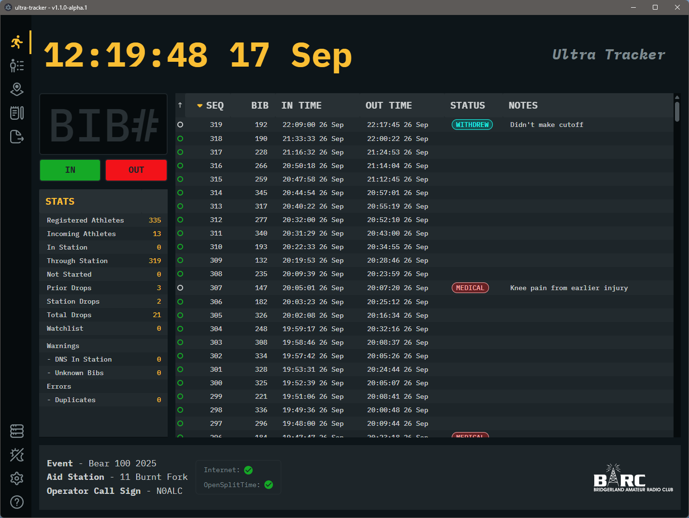

---
## Installation

The app installs as a normal desktop application and can be launched from the Start menu or desktop shortcut.

### Windows Installation

Windows releases are distributed as a standard NSIS installer. Download the latest `ultra-tracker-<version>-setup.exe` from the [releases page](https://github.com/barcradio/ultra-tracker/releases), run the installer, and follow the prompts to complete setup.

### Linux installation

Linux releases are 64-bit only. For Debian, Ubuntu, and Raspberry Pi OS, download the `.deb` package from the [releases page](https://github.com/barcradio/ultra-tracker/releases) and install it with `sudo apt install ./ultra-tracker_<version>_amd64.deb` (or `_arm64.deb` on a Pi). This is the recommended option.

For other Linux distributions, download the `.AppImage` matching the machine architecture: `-x86_64` for a standard PC or `-arm64` for a 64-bit Pi. Make it executable with `chmod +x` and run it. On a Pi, `uname -m` should report `aarch64`; a 32-bit Raspberry Pi OS installation is not supported.

### MacOS Installation

MacOS releases are packaged as a universal DMG. Download the latest `ultra-tracker-<version>.dmg` from the [releases page](https://github.com/barcradio/ultra-tracker/releases), open the disk image, and drag Ultra-Tracker to the Applications folder.

If macOS warns that the app is from an unidentified developer, right-click the application in Applications and choose **Open** once to confirm it, then launch normally. The app is a universal build for Apple Silicon and Intel Macs.

## Getting Started

On first launch, Ultra-Tracker opens **Getting Started** to guide the user through starting an event for timing data collection.

1. Select **Load Event File** and choose the event file (`.zip`) supplied for the event.
2. Select the station identifier for this computer.

## Stats Page

<table align="right" border="0" cellpadding="0" cellspacing="0" width="300">
  <tr>
    <td align="center">
      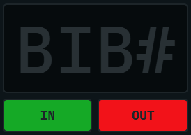 
      <em>BIB# entry and timing controls</em>
    </td>
  </tr>
</table>

The **BIB#** box is the main starting point for using this page. This input control accepts numerical input from either the 10-key pad or the top-row keys of standard keyboards. See the keyboard shortcuts below.

Clicking the **In** and **Out** buttons records the corresponding time entry.

The datagrid columns can be sorted by clicking the column header. Click again to toggle ascending or descending sort.

A filter control for any column can be opened by clicking the Filter icon (three vertical dots). Press **Enter** or the close icon to hide the control again; the filter it holds stays applied.

A second time recorded against a bib already logged at this station is kept as a duplicate and carries a **Duplicate** tag in the Status column. Hovering the tag reports the Seq number of the original record. Clicking it filters the grid to that bib, so the original and every duplicate of it are listed together. Filtering the Status column by `Duplicate` does the same for every bib that was logged more than once, ordered by bib number.

 

### Editing a record

<table align="right" border="0" cellpadding="0" cellspacing="0" width="350">
  <tr>
    <td align="center">
      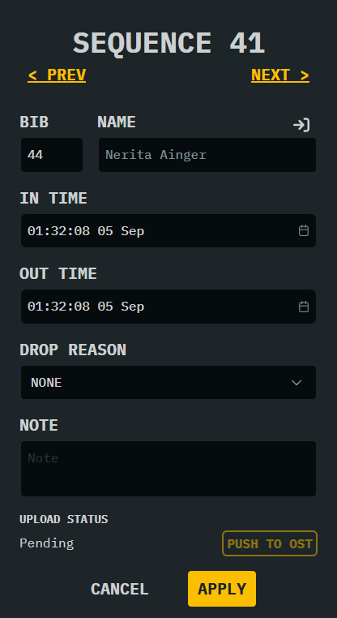 
      <em>Edit a timing record</em>
    </td>
  </tr>
</table>

To edit a timing record, click the icon at the far-right side of the record row.

The Edit pane allows modification or deletion of a timing record. The In and Out times, Drop Reason, and any notes that have been entered will be displayed. Changes to these fields must be applied to take effect, or cancelled to return to the Stats page.

If the Bib# can be matched with a known athlete, the athlete's name will be displayed. The button above the name will jump to that athlete in the Roster page. A timing record for an unknown athlete is considered a warning condition, as all athletes should be known and checked in at the start of the event and included in the Athletes file. For a timing record not matched to athlete, limited changes can be performed; resolve the Bib# to a known athlete to modify all values.

> [!CAUTION]
> Deleting a time record is permanent. An entry to the Log page is recorded for reference.

Validation Rules:

- A record must have an In time.
- An In time must occur before the Out time.
- Commas are not allowed in the Note field and will be replaced with semicolons.

 

### Athlete and Station stats

<table align="left" border="0" cellpadding="0" cellspacing="0" width="300">
  <tr>
    <td align="center">
      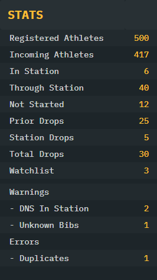 
      <em>Athlete and station statistics</em>
    </td>
  </tr>
</table>

Each of the different statistics available are updated in real time.

The Watchlist count shows athletes marked for follow-up. Hover over the Watchlist row to view their bib numbers and names.

> [!WARNING]
> Warnings should be of interest to the station.

> [!CAUTION]
> Errors should be resolved before sending data to race organizers.

 

### Keyboard shortcuts

Entry of numbers and times is assisted by using some specific keys on both an 88 key (or more) keyboard or a 10-key Numpad. When the cursor is focused in the **Bib#** box, entering a bib number and pressing one of these keys will automatically enter the record and populate the corresponding time.

_10-key entry is recommended for all stations, for laptops without, use a USB 10-key peripheral._

> | 
**In**
 | 
**Out**
 | 
**In and Out**
 |
> | :------------- | :---------------- | :-------------- |
> | [Equal]        | [Minus]           | [Slash]         |
> | [Enter]        | [Numpad-Subtract] | [Backslash]     |
> | [Numpad-Add]   |                   | [Numpad-Divide] |
> | [Numpad-Enter] |                   |                 |

  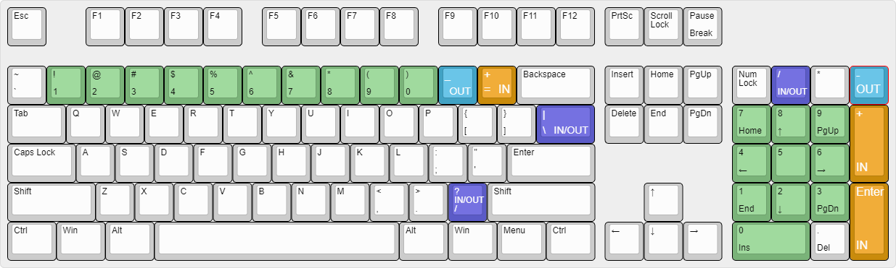
  
<em>Keyboard keys used for In, Out, and combined timing entry</em>

## Roster Page

This page provides the list of all athletes and enables the operator to search for an athlete using different search keys, such as name, bib number, city, start time, station TimeIn, station TimeOut, and note entries.

The Status column helps station operators determine which athletes are pertinent to the station. Valid filter options for the Status column are: `Incoming, DNS (Not Started), In, Out, Medical, Timeout, Withdrew`

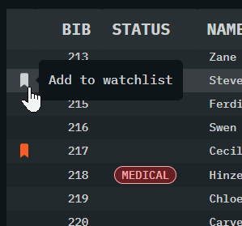     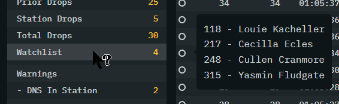

<em>Watchlist controls in the Roster and Stats pages</em>

Use the bookmark button at the left edge of an athlete row to add or remove that athlete from the **Watchlist**. The button appears when the row is hovered; an enabled watchlist button remains visible in red. When a watchlisted athlete arrives at the current station or is included in an imported Drops file, Ultra-Tracker displays an alert. Select **Remove from Watchlist** in the alert to remove the athlete from the Watchlist.

## Stations Page

This page is used to select the Station name and operator callsign. The callsign selection is currently superficial, and is populated by the metadata in the Stations file and cannot be modified during an event.

This page also shows the details about the aid stations throughout the race, including location, mileage, and cutoff times.

> _Note: Callsign selection is for future ham radio integration and does not impact any function at this time._

## Logs Page

This page displays the station log file that is auto-generated during station operation. There are two versions of the log that can be viewed and/or exported for the use of operators or developers to aid in fixing errors that may occur due to programming mistakes or unforeseen situations.

- The normal station log contains entries that occur during regular use and typical data gathering operations. This view may be used by operators to get a detailed understanding of where data errors may have been introduced, such as duplicate timing records.
- The verbose station log is a saved file that contains all events that occurred as well as debug messages designed to assist Ultra-Tracker developers to locate problems that occur during an event. This can be large and should be sent to the developers only upon request.

Watchlist additions, removals, and alerts are recorded in the normal station log with timestamps.

## Export Page

This page provides Export utilities for sending station data to another station or race organizers. These file formats are optimized for human and machine readability.

Timing record indicators show the current delivery state:

| State         | Indicator                                                                                          | Meaning                                                 |
| :------------ | :------------------------------------------------------------------------------------------------- | :------------------------------------------------------ |
| CSV export    |     | Not exported                                            |
| CSV export    |        | Exported by a successful incremental or full CSV export |
| OpenSplitTime |  | Pending upload                                          |
| OpenSplitTime |         | Uploaded                                                |
| OpenSplitTime |      | Upload failed                                           |

- **Export Incremental CSV File**
  This function exports a `.csv` file of the station entries containing unsent or edited records, contains BibID, TimeIn, TimeOut, Drop Reason and any notes made by the operator. The exported file will be automatically named and incremented. e.g. `Aid05Times_04i.csv, Aid05Times_05i.csv, and Aid05Times_06i.csv`.

  Sending recent time records in smaller batches allows for much smaller files being routinely sent to race leadership to import to the race timing site, whether by packet radio or internet. This keeps timing data updated timely for athlete support crews and other situation in an event. Depending on the rate of athletes arriving and departing a station, sending an incremental file _every 30 minutes at a minimim_ is recommended, more often if possible.

  A station setup with a data entry PC networked to a data transmission PC is recommended so interruption of data entry is limited to a quick Incremental Export operation. This allows the data transmission operator to access the exported files independently.

  > [!CAUTION]
  > All Incremental files must be transmitted to the race leadership as each file only contains a portion of the overall station data.

- **Export Full CSV File**
  This function exports a full `.csv` file of **all time records** containing TimeIn, TimeOut, Drop Reason and any notes made by the station operators.

This file is useful as a final station report.

- **Export Drops File**
  This function exports a `.csv` file with all Drop entries (Not Started, Withdrew, Timeout, Medical, Unknown) that have occurred at or before the current station. This file is not normally needed to be sent to race organizers but can be an efficient way of sending the current station's Drops list to another station.

- **Generate Start Line Drops**
  Available only at the Start Line station, and only once the RFID reader has been stopped. This tool compares every registered athlete against those recorded at the Start Line and marks everyone not recorded as a Drop of type **Did Not Start (DNS)**, using the event's official start time.

  Selecting the button opens a preflight review showing Registered, Started, Already Dropped, and New DNS counts. If any duplicate Start Line records or unknown bibs are found, they are listed and generation is blocked until resolved: duplicates must be resolved on the Stats page, and unknown bibs require reloading the event file. Otherwise, check **I confirm the start line is officially closed** to enable **Generate Drops**.

  Generating drops pauses OpenSplitTime pushes (if signed in), records the new DNS drops, and immediately runs the same export as **Export Drops File**. The newly dropped athletes appear on the Stats page with the event start time recorded as both In and Out.

  > [!CAUTION]
  > Run this only once the Start Line has officially closed. Running it early will mark athletes who have not yet started as Did Not Start.

## Event Manager

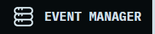

The Event Manager is used to switch between events and recover from local event backups. It keeps a list of saved events and automatic backups, and lets a station operator restore a prior snapshot without losing the current active event.

- **Events** tab lists saved event databases. Select an event and choose **Load Event** to make it the
  active event. The active event is marked with an **Active** tag and cannot be deleted while it is
  active.
- **Backups** tab lists automatic event database backups. Select a backup and choose **Restore Backup**
  to restore it. If an event with the same name already exists, confirm **Restore as New Event** to
  keep both Events.
- **Create New Event** opens the Getting Started workflow for new event.
- **Delete** an inactive event or backup with its delete button. Deleting an event is permanent.
- Enable **Open Event Manager on Startup** to choose an event whenever Ultra-Tracker starts. This
  is useful when the computer is used for more than one event.

  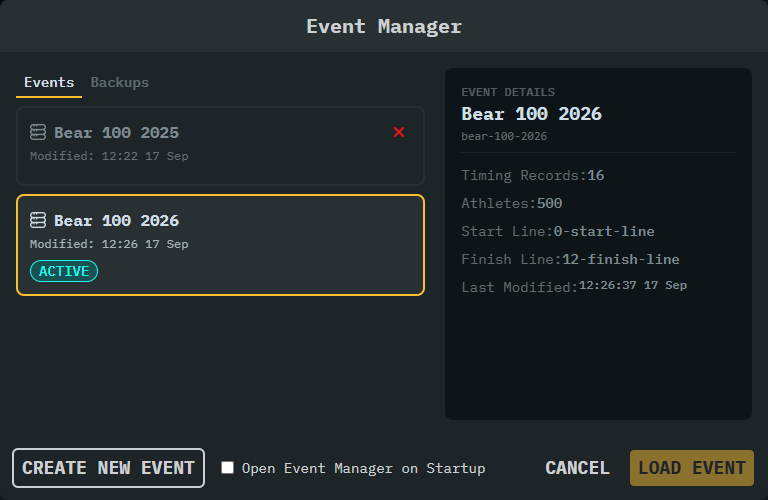
  
<em>Event Manager events and backup controls</em>

## Theme

This is a global selection that allows two different color/shading options for use during daylight or nighttime station operation.

## Settings Page

  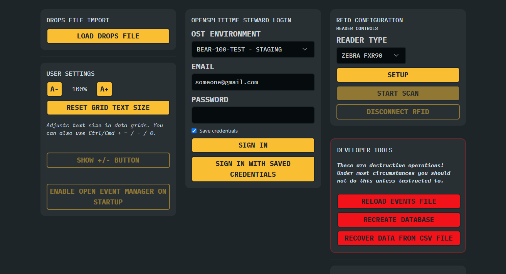
  
<em>Settings workspace and recovery controls</em>

This page allows the operator to manage event input files and the database needed for proper station operation. Event files are loaded and saved from the user's Documents directory (per operating system). File Load/Export dialogs will open here and this directory can be opened quickly via the button provided on the Export page. The settings workspace is also where operators review the event metadata, manage drops imports, and access the OpenSplitTime and recovery controls.

The settings overview also brings together drops imports, OpenSplitTime configuration, and recovery controls so the station can be maintained without leaving the main workflow.

- Windows: `%userprofile%\Documents\ultra-tracker\`
- Linux: `$HOME/Documents/ultra-tracker`
- MacOS: `/Users/username/Documents/ultra-tracker`

### OpenSplitTime

OpenSplitTime is an optional integration for sending timing records directly to the configured event group. The configuration is done per event file, then sign in with an OpenSplitTime steward account that is a member of that event. Credentials can be saved between sessions. If both staging and production event groups are configured, select the environment before signing in. Production events send times to a live event and requires confirmation when switching from staging.

While signed in, OpenSplitTime status takes precedence over CSV export status in the timing-record indicator. Use **Pause Pushes** to temporarily stop automatic uploads without signing out; **Resume Pushes** restarts them. **Sign Out** returns the indicator to the CSV export state and does not change whether a record has been exported.

### User Settings

- **Grid Text Size**
  Use the A-/A+ controls to adjust the size of text in data grids, buttons, and text inputs. The
  setting is saved and restored when Ultra-Tracker is restarted. The keyboard shortcuts are
  Ctrl/Cmd + `=` to increase, Ctrl/Cmd + `-` to decrease, and Ctrl/Cmd + `0` to reset.
- **Show +/- Button**
  Enables the optional +/- action button on the Stats page. This button is useful for touchscreens and is off by default.

> [!CAUTION]
> The functions marked in RED on the Settings page are completely destructive to the local database and **MUST NOT be performed during normal operation!** These are provided only for recovery of the database or data and should only be used at the direction of the software team.

> [!WARNING]
> The functions in ORANGE are provided as a means to completely recover after a major database error and other methods have not corrected the issue.

The following is a description of each button's function. Each of these will open a file open dialog to the `\Documents\Ultra-Tracker\.event-config\` directory.

#### Drops File Import

- **Load Drops File**
  This function loads a `.csv` file, supplied by race organizers, containing all of the athletes known to have **not started** or **dropped from** the race (Withdrew, Timeout, Medical, Unknown).

  As an event proceeds more Drops will be recorded and new Drops files will be supplied to stations.

  Loading a new Drops file opens **Review Drops Import** before any data is imported. The review classifies records as **Conflicts**, **Ready**, **Skipped**, or **Duplicates**. Drops past the current station are skipped to preserve the current station stats, while Ready records can be imported without additional decisions.

  Conflicts are shown with the existing and imported station, drop reason, and time. Each conflict includes a recommendation and an explanation based on the available station data. Select **Preserve** or **Import** for individual conflicts, or use **Apply Recommended**, **Preserve All**, or **Import All** to make a batch decision. The **Apply Import** button shows the number of records selected for import. Select **Cancel Import** to discard the proposed import without changing the current event data.

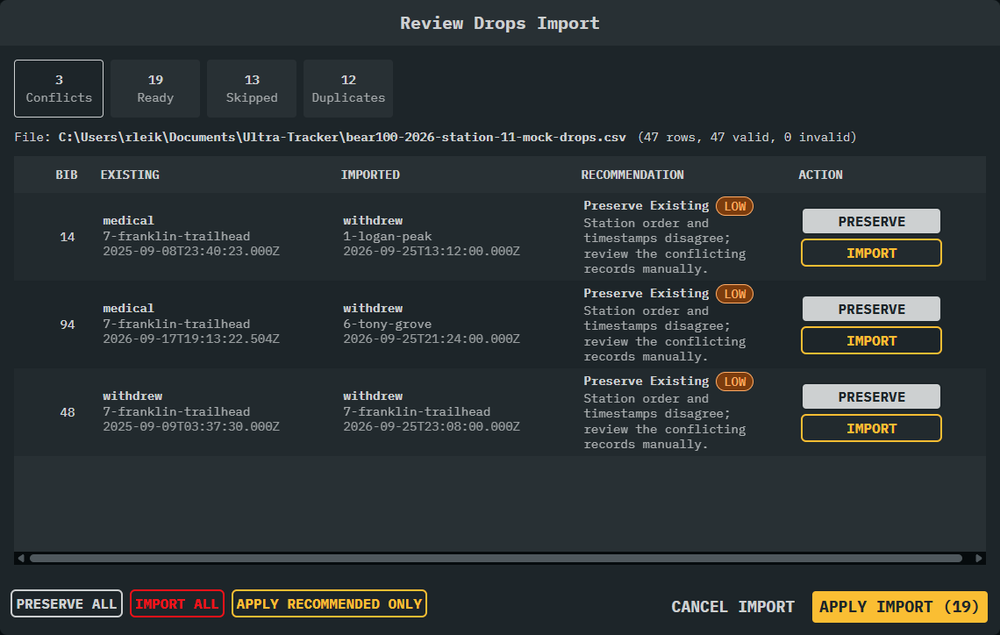

#### RFID Configuration

- **Initialize RFID**
  Starts and stops a RFID reader service for the Zebra FXR90 hardware. These controls are enabled only for Start and Finish Line stations only. Integrations with more RFID hardware will be possible in the future.

#### Application Settings

- **Reset App Settings**
  This will reset the local application settings file to defaults. This can be useful for recovering from an unexpected error.
  The application settings file `config.json` is located at:
  - Windows: `%appdata%\ultra-tracker`
  - Linux: `~/.config/ultra-tracker`
  - MacOS: `~/Library/Application Support/ultra-tracker`

#### Developer Tools

- **Reload Events File**
  This function reloads an event archive file (`.zip`), updating station data, athlete rosters, and initial drop records in the currently loaded event database.
- **Recreate Database**
  This function is the means where _ALL_ **database entries and tables are removed** resulting in the loss of _ALL_ setup data and entry history! The intent is to allow recovery of a major database corruption event and the rapid rebuild and subsequent return to normal operation by the operator.
- **Recover Data From CSV File**
  This function imports **ALL of the entries** that have previously been made by the operator since the start of this race event! The Ultra-Tracker application has been automatically producing a file containing EVERY entry made by the operator continuously during normal operation! This function will restore all of this data to restore the program to the previous state automatically.

### Station Recovery Procedure

> [!WARNING]
> If instructed to do so, after the "Recreate Database" has been performed, perform the following steps:
>
> 1. Create a new event using the Event Manager.
> 1. Reload the event database file.
> 1. Load the Drops file if applicable.
> 1. Import a Full Export file using "Recover Data From CSV File".

### Local Database

Ultra-Tracker runs a SQLite database on the local machine. All transactions are preserved immediately and the operator can close and re-open the app without loss of data. A background task backs up the database to a secondary file, every 5 minutes. This backup is used for emergency use only and may not restore all data in a data-loss event. _Do not modify the local database files using external tools!_

## Development

Ultra-Tracker requires Node 22 or newer. Running `pnpm install` downloads and uses a matching version of Node automatically, so no manual version switching is needed.

- **`pnpm dev`**
  Runs the application in development mode.
- **`pnpm test`**
  Runs the test suite once and reports the result.
- **`pnpm test:watch`**
  Runs the test suite and re-runs it as files change.
- **`pnpm test:coverage`**
  Runs the test suite and produces a coverage report.
- **`pnpm lint`** and **`pnpm typecheck`**
  Check formatting, lint rules, and TypeScript types.

Tests are written with Vitest and live in a `tests/` folder beside the code they cover, such as `src/main/database/tests/`. Every pull request runs the test suite, lint, and typecheck.

## About Ultra-Tracker

A cross-platform desktop application for tracking athletes during ultra marathons.
This project is supported on Windows, Linux and MacOS. Linux is distributed as a `.deb` for Debian, Ubuntu and Raspberry Pi OS, and as an AppImage for other distributions. Both are 64-bit only. The MacOS build is a universal DMG and is not notarized, so clear quarantine on first launch.

Built as an Electron application using TypeScript + React + Tailwind CSS.

**Project Page**: [https://github.com/barcradio/ultra-tracker](https://github.com/barcradio/ultra-tracker)

**Releases**: [https://github.com/barcradio/ultra-tracker/releases](https://github.com/barcradio/ultra-tracker/releases)

## Contributors

> | 
**Name**
 | 
**Call Sign**
 | 
 fontSize:larger">**GitHub**
 |
> | :------------------- | :----------- | :----------------------------------------------------- |
> | **Paul Carter**      | KG7OKR       | [**cartpaul**](https://github.com/cartpauj)            |
> | **Jaren Glenn**      | ---          | [**@derethil**](https://github.com/derethil)           |
> | **David Leikis**     | KG7EW        | [**@DLeikis**](https://github.com/DLeikis)             |
> | **Russ Leikis**      | KE7VFI       | [**@rleikis**](https://github.com/rleikis)             |
> | **Jorden Luke**      | KF7YEM       | [**@JordenLuke**](https://github.com/JordenLuke)       |
> | **Brian Marble**     | KG7AFQ       | [**@brianmarble**](https://github.com/brianmarble)     |
> | **Mitch Smith**      | N8MLS        | [**@pxls2prnt**](https://github.com/pxls2prnt)         |
> | **Brandon Tibbitts** | KD7IIW       | [**@Tibbs327**](https://github.com/Tibbs327)           |

**Notice:** Starting in Aug 2026 our team is utilizing AI technologies, such as GitHub Copilot, to augment development of Ultra-Tracker. All generated code is human reviewed for function and project compliance.

## License

[MIT](https://opensource.org/license/mit) ©2024 [Bridgerland Amateur Radio Club](https://barconline.org/)
