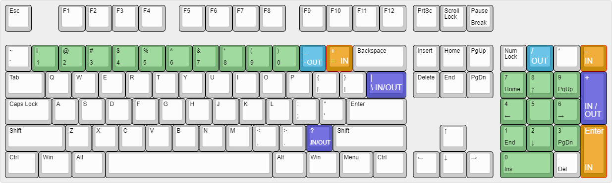

# Ultra-tracker Help <!-- omit in toc -->
---
## Table of Contents <!-- omit in toc -->
- [Initial Setup](#initial-setup)
- [Sidebar](#sidebar)
- [Stats Page](#stats-page)
  - [Athlete edit function](#athlete-edit-function)
  - [Stats SubSection](#stats-subsection)
  - [Keyboard shortcuts](#keyboard-shortcuts)
- [Roster Page](#roster-page)
- [Stations Page](#stations-page)
- [Logs Page](#logs-page)
- [Export Page](#export-page)
- [Theme Page](#theme-page)
- [Settings Page](#settings-page)
  - [Recovery Procedure](#recovery-procedure)
- [About Ultra-tracker](#about-ultra-tracker)
- [Contributors](#contributors)
- [License](#license)

---

## Initial Setup

1. Copy the event files into the default folder location (see settings section below for path)
1. Load the Stations File
   1. Select Station location and set operator callsign
1. Load the Athletes File
1. Load the DNS File
1. Load the DNF File
1. Go to stats screen and begin logging athletes

## Sidebar
The left side bar is used to select different pages.  Select from Stats, Roster, Logs, Export, Theme, Database, Settings and Help. (Hovering over the sidebar area will expand it to show the names.)

## Stats Page

The **BIB#** box should be the main starting point for using this page. This input control will accept numerical input, either from the 10-key pad or top-row keys of all standard keyboards.

Clicking the In button and Out button will record the corresponding time entry.

The datagrid columns can be sorted by clicking on the column header.  Click again to toggle ascending or descending sort. To edit an athlete, click on the "edit icon" at the far-right side of the row for each athlete.

### Athlete edit function

This edit page is able to show the details of the athlete and whether that person is listed in the Start list.  If the bib# is valid, that athlete's name will show in the box and the times for In and Out will display along with DNF, DNS status and any notes that have been entered.  Any of these fields can be modified and applied to be made permanent.

### Stats SubSection

Each of the different statistics available in real-time updates are shown above.

### Keyboard shortcuts
Entry of numbers and times is assisted by using some specific keys on both an 88 key (or more) keyboard or a 10-key Numpad. When the curor is focused in the **Bib#** box, entering a bib number and pressing one of these keys will automatically enter the record and populate the corresponding time.

*10-key entry is recommended for all stations.*

> | 
**In**
 | 
**Out**
 | 
**In and Out**
 |
> | :------------- | :---------------- | :-------------- |
> | [Equal]        | [Minus]           | [Slash]         |
> | [Enter]        | [Numpad-Subtract] | [Backslash]     |
> | [Numpad-Add]   |                   | [Numpad-Divide] |
> | [Numpad-Enter] |                   |                 |

## Roster Page

The purpose of this page is to provide the full list of all athletes and enable the operator to search for an athlete using different search keys, such as, name, bib number, city, start time, Station TimeIn, Station TimeOut and note entries.

## Stations Page

This page is used to select the Station name, and operators names and callsigns.

This page shows the details about the aid stations throughout the race, location, mileage, cutoff times. (Future)

## Logs Page

The purpose of this page is to display and export the station log file that is auto-generated during operation. There are two versions of the log that can be viewed and/or exported for the use of operators or developers to aid in fixing errors that may occur due to programming mistakes or unforeseen situations.
- The normal station log will contain entrees that happened during regular operation that indicates typical data gathering operations. This view may be used by all operators to allow a detailed look at the order and purpose of all standard events that have occurred during operation.
- The verbose station log contains all events that occurred as well as debug messages designed to assist the developers to locate problems that might occur. This file can be large and should be sent to the developers only upon request.

## Export Page

- **Export Incremental CSV File**
This function exports a .csv file of the station entries containing unsent or edited records, contains BibID,TimeIn, TimeOut, DNF/DNS status and any notes made by the operator
(Sending only the recent results allows for much shorter files being routinely sent to the network database via radio.) It will also autmatically name itself and increment the filename for you

- **Export Full CSV File**
This function exports a full .csv file of all entries containing each athlete and their TimeIn, TimeOut, DNF/DNS status and any notes made by the operator of **all events** that have **been entered**. 

- **Export DNS File**

- **Export DNF File**

## Theme Page

This is a global selection that allows two different color/shading options for use during daylight or nighttime operation.

## Settings Page

It also allows the operator to import the various input files and manage the database needed for proper program operation. By default, system initialization files should be copied into user documents directory and file reading/writing selection dialogs will open here.
* Windows: `%userprofile%\Documents\ultra-tracker\`
* Linux: `$HOME/Documents/ultra-tracker`
* MacOS:  `/Users/username/Documents/ultra-tracker`

**Warning: Some of the functions here(marked in RED) are completely destructive to the local database and MUST NOT be performed during normal operation.**

The orange functions are provided as a means to completely recover after a major database error and other methods have not corrected the issue.

The following is a description of each button and its' function.

- **Load Stations File**
This loads a json file containing each of the stations and their detailed information to allow ease of selection while setting up this application. As stated above, a file dialog will allow selection of this file that is typically placed in the default folder location mentioned above. A typical filename will be bear100-YYYY-stations.json.

- **Load Athletes File**  
This function loads a .csv file, supplied by race organizers, containing all of the athletes registered for the event whether they are known to have started or not.

- **Load DNS File**
This function loads a .csv file, supplied by race organizers, containing all of the athletes known to have **not started** the race.

- **Load DNF File**
This function loads a .csv file, supplied by race organizers, containing all of the athletes known to have **not finished** the race.

- **Initialize RFID**
Starts RFID reader service for the Zebra FXR90 
- **Reset App Settings** 

- **Recreate Database**
This function is the means where *ALL* **database entries and tables are removed** resulting in the loss of *ALL* setup data and entry history!  The intent is to allow recovery of a major database corruption event and the rapid rebuild and subsequent return to normal operation by the operator.
   While the previous button of "Recreate Database" is drastic, this allows us to now rebuild the database and application back to the previous state!

**Recover Data From CSV File**
This function imports **ALL of the entries** that have previously been made by the operator since the start of this race event!  The Ultra-tracker application has been automatically producing a file containing EVERY entry made by the operator continuously during normal operation! This function will restore all of this data to restore the program to the previous state automatically.

### Recovery Procedure
If instructed to do so,
after the "Recreate Database" has been performed, perform the following steps:

1. Load the Stations File.
1. Load the Athletes File.
1. Load the DNS File.
1. Load the DNF File.
1. Import History File to DB.

## About Ultra-tracker
A cross-platform desktop application for tracking athletes during ultra marathons.
This project is supported on Windows, Linux, and MacOS.

Built as an Electron application using TypeScript + React + Tailwind CSS.

**Project Page**: [https://github.com/barcradio/ultra-tracker](https://github.com/barcradio/ultra-tracker)

**Releases**: [https://github.com/barcradio/ultra-tracker/releases](https://github.com/barcradio/ultra-tracker/releases)

## Contributors
> | 
**Name**
 | 
**Callsign**
 | 
 fontSize:larger">**GitHub**
 |
> | :------------------- | :----------- | :----------------------------------------------------- |
> | **Jaren Glenn**      | ---          | [**@derethil**](https://github.com/derethil)           |
> | **David Leikis**     | KG7EW        | [**@DLeikis**](https://github.com/DLeikis)             |
> | **Russ Leikis**      | KE7VFI       | [**@rleikis**](https://github.com/rleikis)             |
> | **Jorden Luke**      | KF7YEM       | [**@JordenLuke**](https://github.com/JordenLuke)       |
> | **Brian Marble**     | KG7AFQ       | [**@brianmarble**](https://github.com/brianmarble)     |
> | **Mitch Smith**      | N8MLS        | [**@pxls2prnt**](https://github.com/pxls2prnt)         |
> | **Brandon Tibbitts** | KD7IIW       | [**@Tibbs327**](https://github.com/Tibbs327)           |

## License
[MIT](https://opensource.org/license/mit) ©2024 [Bridgerland Amatuer Radio Club](https://barconline.org/)
